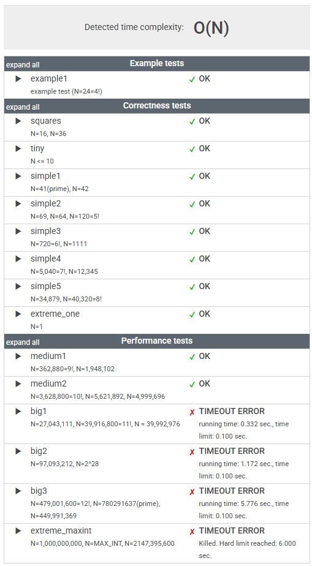

# 문제

A positive integer D is a factor of a positive integer N if there exists an integer M such that N = D * M.

For example, 6 is a factor of 24, because M = 4 satisfies the above condition (24 = 6 * 4).

Write a function:

    class Solution { public int solution(int N); }

that, given a positive integer N, returns the number of its factors.

For example, given N = 24, the function should return 8, because 24 has 8 factors, namely 1, 2, 3, 4, 6, 8, 12, 24. There are no other factors of 24.

Write an efficient algorithm for the following assumptions:

* N is an integer within the range [1..2,147,483,647].

# 정리

### 초기 풀이

```java
    public int solution1(int N) {
        int i = 1;
        int result = 0;

        while (i <= N) {
            if (N % i == 0) {
                result++;
            }
            i++;
        }

        return result;
    }
```




__브루트 포스(Brute Force, 완전 탐색)__ 이므로, 

최악의 경우 N = 2,147,483,647 (int의 최댓값)일 때 21억 번 반복해야 하므로 비효율적이다.

---

### 최종 풀이

```java
    public int solution2(int N) {
        int result = 0;
        int sqrtN = (int) Math.sqrt(N);

        for (int i = 1; i <= sqrtN; i++) {
            if (N % i == 0) {
                result += 2;
                if (i == N / i) result--;
            }
        }

        return result;
    }
```

___N의 약수를 구할 때는, 1부터 N의 제곱근 까지의 수만 0으로 나누어 떨어지는지 확인하면 된다.___

N이 100일 경우를 예를 들어보자,

제곱근까지만 구하기로 했으니, 1 ~ 10 으로 나눈 100 이 나누어 떨어지는지 보면 된다.

    100 % 1 = 0
    100 % 2 = 0
    100 % 3 = 1
    100 % 4 = 0
    100 % 5 = 0
    100 % 6 = 4
    100 % 7 = 2
    100 % 8 = 4
    100 % 9 = 1
    100 % 10 = 0

100의 약수는 우선 1, 2, 4, 5, 10 이 있다는 것을 알 수 있다.

이제, 100을 이미 구해진 1, 2, 4, 5, 10 으로 나누면 

    100 / 1 = 100
    100 / 2 = 50
    100 / 4 = 25
    100 / 5 = 20
    100 / 10 = 10

그렇게 되면, 이미 구했던 1, 2, 4, 5, 10 외에 100, 50, 25, 20, 10이 추가로 구해진 약수가 된다는 것을 알 수 있다.
