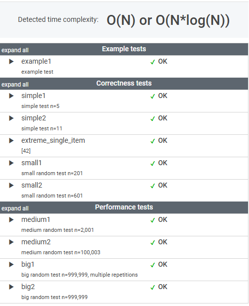

# 문제

A non-empty array A consisting of N integers is given. The array contains an odd number of elements, and each element of the array can be paired with another element that has the same value, except for one element that is left unpaired.

For example, in array A such that:

    A[0] = 9  A[1] = 3  A[2] = 9
    A[3] = 3  A[4] = 9  A[5] = 7
    A[6] = 9

  - the elements at indexes 0 and 2 have value 9,
  - the elements at indexes 1 and 3 have value 3,
  - the elements at indexes 4 and 6 have value 9,
  - the element at index 5 has value 7 and is unpaired.

    Write a function:

class Solution { public int solution(int[] A); }

that, given an array A consisting of N integers fulfilling the above conditions, returns the value of the unpaired element.

For example, given array A such that:

    A[0] = 9  A[1] = 3  A[2] = 9
    A[3] = 3  A[4] = 9  A[5] = 7
    A[6] = 9

the function should return 7, as explained in the example above.

Write an efficient algorithm for the following assumptions:

  - N is an odd integer within the range [1..1,000,000];
  - each element of array A is an integer within the range [1..1,000,000,000];
  - all but one of the values in A occur an even number of times.

# 풀이

```java

    public int solution(int[] A) {
        int result = 0;
    
    1.  Map에 배열의 값을 Key로 사용하여 갯수를 저장한다.
        
        HashMap<Integer, Integer> map = new HashMap<>();
    
    2.  map.getOrDefault(A[i], 0)+1 을 통해 값을 꺼내서 +1을 한다. 없었던 값이면 Default 로 0 을 가져온 뒤 1을 더한다. 
    
        for (int i = 0; i < A.length; i++) {
            map.put(A[i], map.getOrDefault(A[i], 0)+1);
        }
    
    3.  Map 에 담긴 Value를 2로 나눠 짝수 여부를 확인한다. 짝수가 아닐 경우 해당 값 return
        
        for (Integer integer : map.keySet()) {
            if (map.get(integer) % 2 == 1) {
                result = integer;
            }
        }
    
        return result;
    }

```
# 정리

난이도가 쉬운 편이지만, 검색의 도움없이 처음으로 100% score 로 통과한 예제이다.  
알고리즘 문제를 처음 접했을 때는 어떻게 풀어야할지 감도 안 왔는데, 조금씩 나아지는 것 같다.


