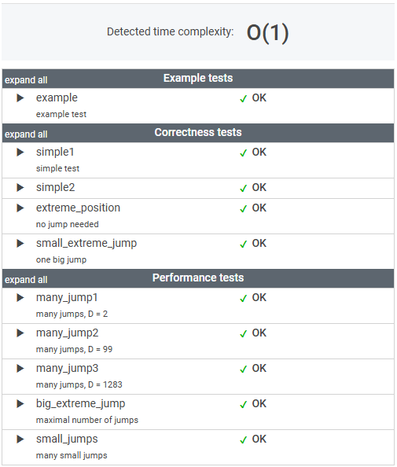

# 문제

A small frog wants to get to the other side of the road. The frog is currently located at position X and wants to get to a position greater than or equal to Y. The small frog always jumps a fixed distance, D.

Count the minimal number of jumps that the small frog must perform to reach its target.

Write a function:

    class Solution { public int solution(int X, int Y, int D); }

that, given three integers X, Y and D, returns the minimal number of jumps from position X to a position equal to or greater than Y.

For example, given:

    X = 10
    Y = 85
    D = 30
the function should return 3, because the frog will be positioned as follows:

- after the first jump, at position 10 + 30 = 40
- after the second jump, at position 10 + 30 + 30 = 70
- after the third jump, at position 10 + 30 + 30 + 30 = 100

Write an **efficient** algorithm for the following assumptions:

- X, Y and D are integers within the range [1..1,000,000,000];
- X ≤ Y.

# 풀이

```java

    public int solution(int X, int Y, int D) {
        int result = 0;
        
    1.  개구리가 몇 번 뛰어야하는지 계산하기 위해 목표 거리 Y에서 시작거리 X를 빼고 
        한번의 점프 거리 D로 나눈다. Y이상의 거리가 나와야 하기 때문에, 올림(Math.ceil)을 사용한다.
        int 형은 정수로만 값이 나오기 때문에 double 로 형변환 후 계산 올림을 한다.
            
        // 캐스팅 형변환 필요. int -> double (소수점 계산)
        result = (int) Math.ceil((double)(Y - X) / D);
        
        return result;
    }

```
---

기본이 부족하다는 걸 다시금 느끼게 한 문제였다.

처음엔 아무 생각 없이 정답을 다음과 같이 제출했지만, 의도와 다른 테스트 결과가 나와 당황했다.

    result = Math.ceil((Y - X) / D);

int형이 정수로 반환된다는 점을 잊고 있었던 것이다. 

숫자 데이터 타입에 대한 개념이 미흡했던 점을 돌아보게 된 계기였다.

