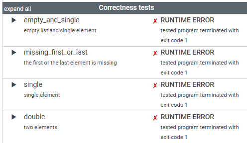
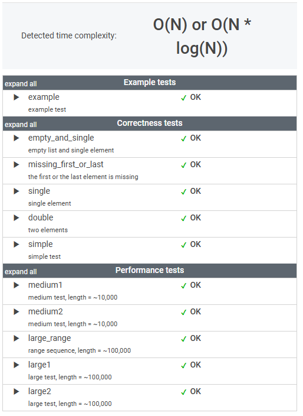

# 문제

An array A consisting of N different integers is given. The array contains integers in the range [1..(N + 1)], which means that exactly one element is missing.

Your goal is to find that missing element.

Write a function:

    class Solution { public int solution(int[] A); }

that, given an array A, returns the value of the missing element.

For example, given array A such that:

    A[0] = 2
    A[1] = 3
    A[2] = 1
    A[3] = 5
the function should return 4, as it is the missing element.

Write an efficient algorithm for the following assumptions:

N is an integer within the range [0..100,000];
the elements of A are all distinct;
each element of array A is an integer within the range [1..(N + 1)].

# 풀이

```java

    public int solution(int[] A) {
    
            int result = 0;
            
        1.  배열 요소의 최댓값 N 
            1 ... N 의 총합(기댓값)을 구한다.
            
            int N = A.length + 1;
            long expectedSum = (long) N * (N + 1) / 2;
    
        2.  실제 배열 요소들의 총합을 구한다.
            
            long sum = Arrays.stream(A).sum();
    
        3.  기댓값과 총합의 차를 구하면 그 차 만큼이 missing element 가 된다. 
            
            result = (int) (expectedSum - sum);
    
            return result;
    }

```

# 정리

정렬 -> 반복문을 이용해 인덱스 + 1 값이 맞는지 확인하는 방법도 생각해봤다.
```java
  public int solution(int[] A) {
        int result = 0;

        Arrays.sort(A);

        return IntStream.range(1, A.length + 1)
                .filter(i -> i != A[i-1])
                .findFirst().getAsInt();
    }
```
숫자가 커지니 런타임 오류가 발생한다... 



---

기댓값 - 실제총합 결과

