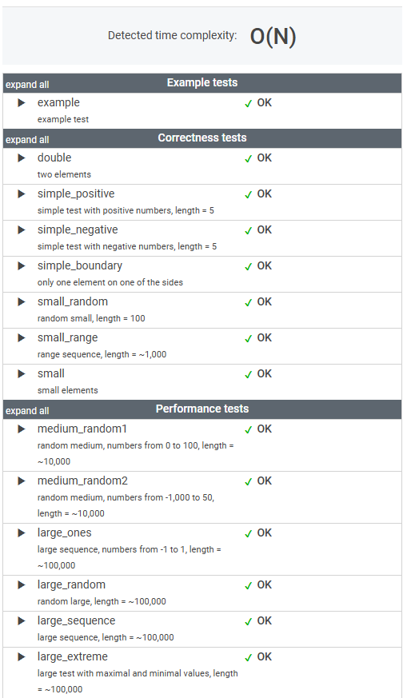

# 문제

A non-empty array A consisting of N integers is given. Array A represents numbers on a tape.

Any integer P, such that 0 < P < N, splits this tape into two non-empty parts: A[0], A[1], ..., A[P − 1] and A[P], A[P + 1], ..., A[N − 1].

The difference between the two parts is the value of: |(A[0] + A[1] + ... + A[P − 1]) − (A[P] + A[P + 1] + ... + A[N − 1])|

In other words, it is the absolute difference between the sum of the first part and the sum of the second part.

For example, consider array A such that:

    A[0] = 3
    A[1] = 1
    A[2] = 2
    A[3] = 4
    A[4] = 3
We can split this tape in four places:

* P = 1, difference = |3 − 10| = 7
* P = 2, difference = |4 − 9| = 5
* P = 3, difference = |6 − 7| = 1
* P = 4, difference = |10 − 3| = 7

Write a function:

    class Solution { public int solution(int[] A); }

that, given a non-empty array A of N integers, returns the minimal difference that can be achieved.

For example, given:

    A[0] = 3
    A[1] = 1
    A[2] = 2
    A[3] = 4
    A[4] = 3
the function should return 1, as explained above.

Write an efficient algorithm for the following assumptions:

* N is an integer within the range [2..100,000];
* each element of array A is an integer within the range [−1,000..1,000].

# 풀이

```java
    public int solution(int[] A) {

        /**
         * 왼쪽 배열의 합 ( 인덱스 0 부터 sum )
         * 오른쪽 배열의 합 ( 배열의 총합에서 인덱스 0 부터 뺴준다. )
         * 매 반복시 최소값을 구한다.
         */

        int leftSum = 0;
        int rightSum = Arrays.stream(A).sum();
        int result = Integer.MAX_VALUE;

        for (int i = 0; i < A.length - 1; i++) {
            leftSum += A[i];
            rightSum -= A[i];
            int currentDifference = Math.abs(leftSum - rightSum);
            result = Math.min(result, currentDifference);
        }

        return result;
    }
```

# 정리

