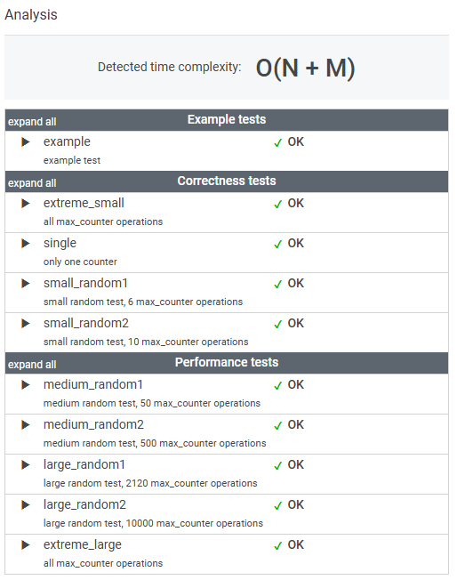

# 문제

You are given N counters, initially set to 0, and you have two possible operations on them:

* increase(X) − counter X is increased by 1,
* max counter − all counters are set to the maximum value of any counter.

A non-empty array A of M integers is given. This array represents consecutive operations:

* if A[K] = X, such that 1 ≤ X ≤ N, then operation K is increase(X),
* if A[K] = N + 1 then operation K is max counter.

For example, given integer N = 5 and array A such that:

    A[0] = 3
    A[1] = 4
    A[2] = 4
    A[3] = 6
    A[4] = 1
    A[5] = 4
    A[6] = 4

the values of the counters after each consecutive operation will be:

    (0, 0, 1, 0, 0)
    (0, 0, 1, 1, 0)
    (0, 0, 1, 2, 0)
    (2, 2, 2, 2, 2)
    (3, 2, 2, 2, 2)
    (3, 2, 2, 3, 2)
    (3, 2, 2, 4, 2)

The goal is to calculate the value of every counter after all operations.

Write a function:

    class Solution { public int[] solution(int N, int[] A); }

that, given an integer N and a non-empty array A consisting of M integers, returns a sequence of integers representing the values of the counters.

Result array should be returned as an array of integers.

For example, given:

    A[0] = 3
    A[1] = 4
    A[2] = 4
    A[3] = 6
    A[4] = 1
    A[5] = 4
    A[6] = 4

the function should return [3, 2, 2, 4, 2], as explained above.

Write an efficient algorithm for the following assumptions:

* N and M are integers within the range [1..100,000];
* each element of array A is an integer within the range [1..N + 1].

# 풀이

```java

    public int[] solution(int N, int[] A) {
        int[] counters = new int[N]; // N개의 카운터 배열
        int maxCounter = 0;          // 현재 최대 카운터 값
        int lastMaxUpdate = 0;       // 마지막 max counter 연산 시의 값

        // 배열 A의 각 연산을 처리
        for (int i = 0; i < A.length; i++) {
            int operation = A[i];

            if (operation >= 1 && operation <= N) {
                // increase(X) 연산: 카운터를 1 증가
                if (counters[operation - 1] < lastMaxUpdate) {
                    // 이전 max counter 연산이 적용되지 않은 경우 값을 갱신
                    counters[operation - 1] = lastMaxUpdate;
                }
                counters[operation - 1]++;

                // 최대 카운터 값 갱신
                if (counters[operation - 1] > maxCounter) {
                    maxCounter = counters[operation - 1];
                }
            } else if (operation == N + 1) {
                // max counter 연산: 모든 카운터를 현재 최대 값으로 설정
                lastMaxUpdate = maxCounter;
            }
        }

        // 마지막 max counter 연산이 적용되지 않은 카운터들을 업데이트
        for (int i = 0; i < N; i++) {
            if (counters[i] < lastMaxUpdate) {
                counters[i] = lastMaxUpdate;
            }
        }

        return counters;
    }
```

# 정리

max counter 가 발생했을 때, 카운터의 모든 값을 한 번에 update 하지 않고

최대카운터 값을 저장하고 사용하는 것이 훨씬 효율적이다.

