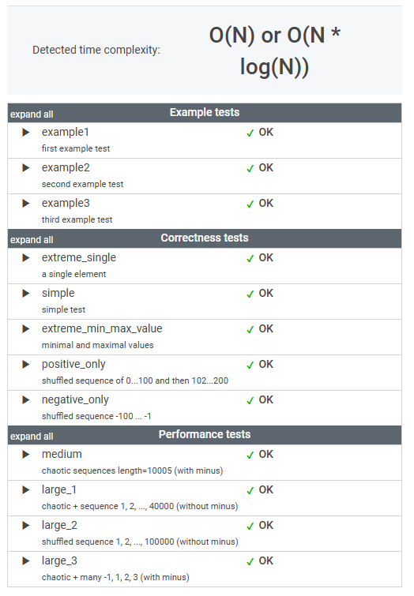

# 문제

This is a demo task.

Write a function:

    class Solution { public int solution(int[] A); }

that, given an array A of N integers, returns the smallest positive integer (greater than 0) that does not occur in A.

For example, given A = [1, 3, 6, 4, 1, 2], the function should return 5.

Given A = [1, 2, 3], the function should return 4.

Given A = [−1, −3], the function should return 1.

Write an efficient algorithm for the following assumptions:

* N is an integer within the range [1..100,000];
* each element of array A is an integer within the range [−1,000,000..1,000,000].

# 풀이

```java
    public int solution(int[] A) {

        Set<Integer> positiveNumbers = Arrays.stream(A)
                .filter(x -> x > 0) // 양수의 정수만
                .collect(HashSet::new, HashSet::add, HashSet::addAll);

/**
 * 1 부터 Integer.MAX_VALUE 까지 positiveNumbers의 값과 비교한다. 
 * 비교하는 수가 없을 경우 그 값을 반환
 */
        return IntStream.range(1, Integer.MAX_VALUE)
                .filter(x -> !positiveNumbers.contains(x))
                .findFirst()
                .getAsInt();
        
    }
```

# 정리

스트림 사용법이 조금씩 익숙해지고 있다.

