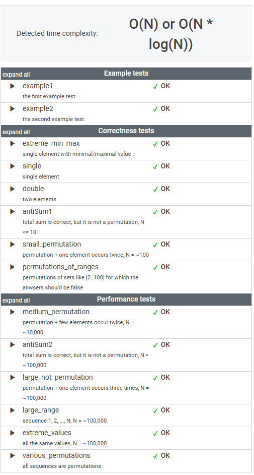

# 문제

A non-empty array A consisting of N integers is given.

A permutation is a sequence containing each element from 1 to N once, and only once.

For example, array A such that:

    A[0] = 4
    A[1] = 1
    A[2] = 3
    A[3] = 2
is a permutation, but array A such that:

    A[0] = 4
    A[1] = 1
    A[2] = 3
is not a permutation, because value 2 is missing.

The goal is to check whether array A is a permutation.

Write a function:

    class Solution { public int solution(int[] A); }

that, given an array A, returns 1 if array A is a permutation and 0 if it is not.

For example, given array A such that:

    A[0] = 4
    A[1] = 1
    A[2] = 3
    A[3] = 2
the function should return 1.

Given array A such that:

    A[0] = 4
    A[1] = 1
    A[2] = 3
the function should return 0.

Write an efficient algorithm for the following assumptions:

* N is an integer within the range [1..100,000];
* each element of array A is an integer within the range [1..1,000,000,000].

# 풀이

```java
    public int solution(int[] A) {
        int N = A.length;

        // 배열에 중복된 숫자가 있으면 0 반환
        boolean hasDuplicates = Arrays.stream(A)
                                        .distinct()
                                        .count() != N;
        if (hasDuplicates) {
            return 0;
        }

        // 1부터 N까지의 숫자가 모두 있는지 확인
        boolean vaildRange = Arrays.stream(A)
                .allMatch(i -> i >= 1 && i <= N);

        if (!vaildRange) {
            return 0;
        }

        // 순열이면 1 반환
        return 1;
    }
```


# 정리

