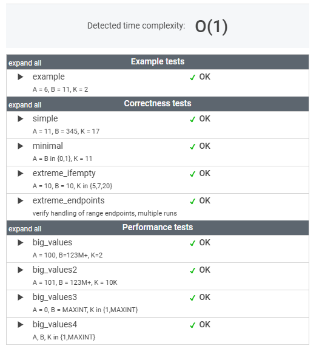

# 문제

Write a function:

    class Solution { public int solution(int A, int B, int K); }

that, given three integers A, B and K, returns the number of integers within the range [A..B] that are divisible by K, i.e.:

    { i : A ≤ i ≤ B, i mod K = 0 }

For example, for A = 6, B = 11 and K = 2, your function should return 3, because there are three numbers divisible by 2 within the range [6..11], namely 6, 8 and 10.

Write an efficient algorithm for the following assumptions:

* A and B are integers within the range [0..2,000,000,000];
* K is an integer within the range [1..2,000,000,000];
* A ≤ B.

# 풀이

```java
    public int solution(int A, int B, int K) {
        // B까지 K로 나누어 떨어지는 수의 개수
        int countUpToB = B / K;
        // A가 0일 경우 0은 무엇으로 나눠도 나머지가 0 이기 때문에 횟수 1 을 추가한다.
        return (A > 0) ? countUpToB - (A - 1) / K : countUpToB + 1;
    }
```


# 정리

한심하게도 숫자 하나하나 나눠지는지 반복문을 통해서 답을 구하려고 했다...

직관적이고 효율적인 방법이 무엇인지 끝까지 고민을 해야겠다.

