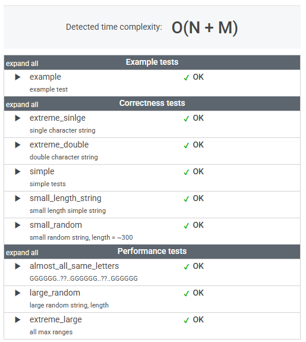

# 문제

A DNA sequence can be represented as a string consisting of the letters A, C, G and T, which correspond to the types of successive nucleotides in the sequence. Each nucleotide has an impact factor, which is an integer. Nucleotides of types A, C, G and T have impact factors of 1, 2, 3 and 4, respectively. You are going to answer several queries of the form: What is the minimal impact factor of nucleotides contained in a particular part of the given DNA sequence?

The DNA sequence is given as a non-empty string S = S[0]S[1]...S[N-1] consisting of N characters. There are M queries, which are given in non-empty arrays P and Q, each consisting of M integers. The K-th query (0 ≤ K < M) requires you to find the minimal impact factor of nucleotides contained in the DNA sequence between positions P[K] and Q[K] (inclusive).

For example, consider string S = CAGCCTA and arrays P, Q such that:

    P[0] = 2    Q[0] = 4
    P[1] = 5    Q[1] = 5
    P[2] = 0    Q[2] = 6

The answers to these M = 3 queries are as follows:

* The part of the DNA between positions 2 and 4 contains nucleotides G and C (twice), whose impact factors are 3 and 2 respectively, so the answer is 2.
* The part between positions 5 and 5 contains a single nucleotide T, whose impact factor is 4, so the answer is 4.
* The part between positions 0 and 6 (the whole string) contains all nucleotides, in particular nucleotide A whose impact factor is 1, so the answer is 1.

Write a function:

    class Solution { public int[] solution(String S, int[] P, int[] Q); }

that, given a non-empty string S consisting of N characters and two non-empty arrays P and Q consisting of M integers, returns an array consisting of M integers specifying the consecutive answers to all queries.

Result array should be returned as an array of integers.

For example, given the string S = CAGCCTA and arrays P, Q such that:

    P[0] = 2    Q[0] = 4
    P[1] = 5    Q[1] = 5
    P[2] = 0    Q[2] = 6

the function should return the values [2, 4, 1], as explained above.

Write an efficient algorithm for the following assumptions:

* N is an integer within the range [1..100,000];
* M is an integer within the range [1..50,000];
* each element of arrays P and Q is an integer within the range [0..N - 1];
* P[K] ≤ Q[K], where 0 ≤ K < M;
* string S consists only of upper-case English letters A, C, G, T.

# 풀이

```java
    public int[] solution(String S, int[] P, int[] Q) {
        int N = S.length();
        int M = P.length;

        // Prefix sum 배열 초기화
        int[] A = new int[N + 1];
        int[] C = new int[N + 1];
        int[] G = new int[N + 1];

        for (int i = 0; i < N; i++) {
            A[i + 1] = A[i];
            C[i + 1] = C[i];
            G[i + 1] = G[i];

            char nucleotide = S.charAt(i);
            if (nucleotide == 'A') {
                A[i + 1]++;
            } else if (nucleotide == 'C') {
                C[i + 1]++;
            } else if (nucleotide == 'G') {
                G[i + 1]++;
            }
        }

        // 쿼리 처리
        int[] result = new int[M];
        for (int k = 0; k < M; k++) {
            int start = P[k];
            int end = Q[k] + 1; // Prefix sum이므로 end + 1
            
            if (A[end] - A[start] > 0) {
                result[k] = 1;  // A 존재
            } else if (C[end] - C[start] > 0) {
                result[k] = 2;  // C 존재
            } else if (G[end] - G[start] > 0) {
                result[k] = 3;  // G 존재
            } else {
                result[k] = 4;  // T 존재
            }
        }

        return result;

    }
```

# 정리

### 초기 접근 방식

처음엔 단순히 int[] P, int[] Q 배열에 따라 반복문을 돌려서 범위마다 최소 impact factor를 계산하려 했다. 

하지만 이 방식은 범위가 많거나 문자열 길이가 길어질수록 비효율적이었다.

𝑂(𝑁 × 𝑀) 의 시간 복잡도를 가진 이 방법은 현실적으로 적합하지 않았다.

---

1. 누적 카운트 배열 생성 
A, C, G의 등장 횟수를 누적 배열로 만들어 인덱스별로 관리한다.
예를 들어, 인덱스 𝑖 에서 A가 몇 번 나왔는지는 𝐴[𝑖+ 1]− 𝐴[𝑠 𝑡 𝑎 𝑟 𝑡]로 계산할 수 있다.


2. 쿼리 처리
범위 [P[K],Q[K]]에서 A, C, G, T 순으로 존재 여부를 확인한다. 가장 먼저 발견된 뉴클레오타이드가 최소 impact factor를 가지므로, 첫 번째로 조건을 만족한 뉴클레오타이드의 impact factor를 결과로 저장한다.

___prefixSums___ 의 아이디어를 사용하려면 조금 더 익숙해져야할 것 같다.


