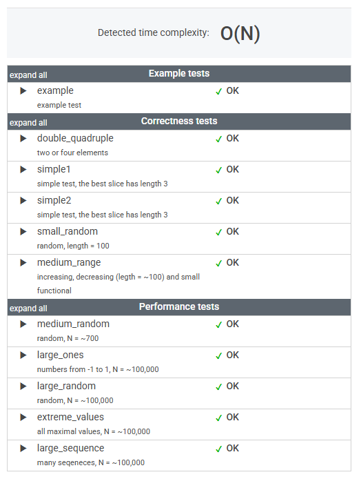

# 문제

A non-empty array A consisting of N integers is given. A pair of integers (P, Q), such that 0 ≤ P < Q < N, is called a slice of array A (notice that the slice contains at least two elements). The average of a slice (P, Q) is the sum of A[P] + A[P + 1] + ... + A[Q] divided by the length of the slice. To be precise, the average equals (A[P] + A[P + 1] + ... + A[Q]) / (Q − P + 1).

For example, array A such that:

    A[0] = 4
    A[1] = 2
    A[2] = 2
    A[3] = 5
    A[4] = 1
    A[5] = 5
    A[6] = 8

contains the following example slices:

* slice (1, 2), whose average is (2 + 2) / 2 = 2;
* slice (3, 4), whose average is (5 + 1) / 2 = 3;
* slice (1, 4), whose average is (2 + 2 + 5 + 1) / 4 = 2.5.

The goal is to find the starting position of a slice whose average is minimal.

Write a function:

    class Solution { public int solution(int[] A); }

that, given a non-empty array A consisting of N integers, returns the starting position of the slice with the minimal average. If there is more than one slice with a minimal average, you should return the smallest starting position of such a slice.

For example, given array A such that:

    A[0] = 4
    A[1] = 2
    A[2] = 2
    A[3] = 5
    A[4] = 1
    A[5] = 5
    A[6] = 8

the function should return 1, as explained above.

Write an efficient algorithm for the following assumptions:

* N is an integer within the range [2..100,000];
* each element of array A is an integer within the range [−10,000..10,000].

# 풀이

```java
    public int solution(int[] A) {
        int startingPosition = 0;
        double minValue = Double.MAX_VALUE;
    
        int length = A.length;
    
        for (int i = 0; i < length - 1; i++) {
            double avg2 = (A[i] + A[i + 1]) / 2.0;
            if (avg2 < minValue) {
                minValue = avg2;
                startingPosition = i;
            }
    
            if (i < length - 2) {
                double avg3 = (A[i] + A[i + 1] + A[i + 2]) / 3.0;
                if (avg3 < minValue) {
                    minValue = avg3;
                    startingPosition = i;
                }
            }
        }
    
        return startingPosition;
    }
```


# 정리

### 초기 접근 방식

__브루트포스(Brute Force)__ 즉, 모든 슬라이스를 계산하려고 시도했다.

시간 복잡도가 _O(N²)_ 이 되는 바람에 _N_ 이 커질 경우 너무 느리다.

---

### 최종 풀이 

슬라이스의 길이가 길수록 평균에 큰 영향을 미치는 요소가 줄어든다.

길이가 2 또는 3인 슬라이스만 고려해도 충분하다고 한다. 

수학적 증명에 기반한 것이라고 하는데, 정확한 이유는 찾아봐야할 것 같다.

---

### 느낀 점

초기 접근 방식과 최종 풀이의 기본 로직은 동일하다.

다만, 계산 범위를 줄이는 최적화 방법을 적용해 효율적으로 해결했다.

이 문제는 수학적 직관이 풀이의 핵심이었다고 볼 수 있다.

