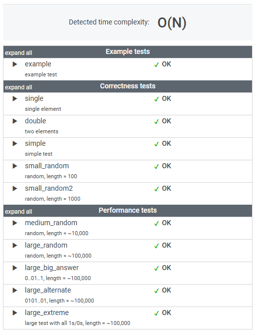

# 문제

A non-empty array A consisting of N integers is given. The consecutive elements of array A represent consecutive cars on a road.

Array A contains only 0s and/or 1s:

* 0 represents a car traveling east,
* 1 represents a car traveling west.

The goal is to count passing cars. We say that a pair of cars (P, Q), where 0 ≤ P < Q < N, is passing when P is traveling to the east and Q is traveling to the west.

For example, consider array A such that:

    A[0] = 0
    A[1] = 1
    A[2] = 0
    A[3] = 1
    A[4] = 1

We have five pairs of passing cars: (0, 1), (0, 3), (0, 4), (2, 3), (2, 4).

Write a function:

    class Solution { public int solution(int[] A); }

that, given a non-empty array A of N integers, returns the number of pairs of passing cars.

The function should return −1 if the number of pairs of passing cars exceeds 1,000,000,000.

For example, given:

    A[0] = 0
    A[1] = 1
    A[2] = 0
    A[3] = 1
    A[4] = 1

the function should return 5, as explained above.

Write an efficient algorithm for the following assumptions:

* N is an integer within the range [1..100,000];
* each element of array A is an integer that can have one of the following values: 0, 1.

# 풀이

```java
    public int solution(int[] A) {
        int eastCount = 0;
        int result = 0;


        /**
         * 서쪽 방향일 때, 그동안 동쪽 방향으로 갔던 차의 대수를 합산한다.
         */
        
        for (int i = 0; i < A.length; i++) {
            if (A[i] == 1) {
                result += eastCount;
            } else {
                eastCount++;
            }

            if (result > 1000000000) {
                return -1;
            }
        }
        return result;
    }
```


# 정리

배열의 요소를 각각 서쪽인지 동쪽인지 비교하는 것은 효율적이지 못하다.

동쪽으로 움직인 차량의 대수를 합으로 관리하고 서쪽 방향으로 움직일 때 그 합을 이용한다.

