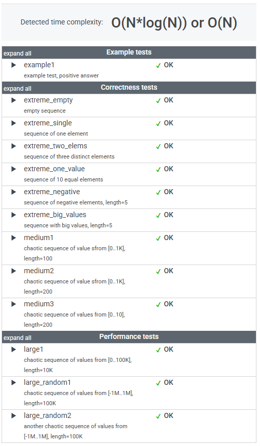

# 문제

Write a function

    class Solution { public int solution(int[] A); }

that, given an array A consisting of N integers, returns the number of distinct values in array A.

For example, given array A consisting of six elements such that:

    A[0] = 2    A[1] = 1    A[2] = 1
    A[3] = 2    A[4] = 3    A[5] = 1

the function should return 3, because there are 3 distinct values appearing in array A, namely 1, 2 and 3.

Write an efficient algorithm for the following assumptions:

* N is an integer within the range [0..100,000];
* each element of array A is an integer within the range [−1,000,000..1,000,000].

# 풀이

```java
    public int solution(int[] A) {
        return Arrays.stream(A).distinct().toArray().length;
    }
```


# 정리

### 초기 접근 방식

stream에서 제공하는 distinct를 사용했다.

---

### 최종 풀이

상동

---

### 느낀 점

set으로 변환해 중복을 제거한 뒤 size를 구하는 방법도 생각했다.

