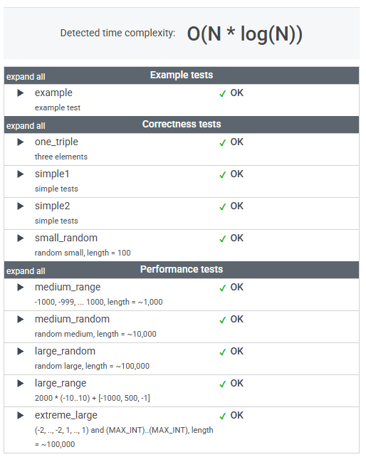

# 문제

A non-empty array A consisting of N integers is given. The product of triplet (P, Q, R) equates to A[P] * A[Q] * A[R] (0 ≤ P < Q < R < N).

For example, array A such that:

    A[0] = -3
    A[1] = 1
    A[2] = 2
    A[3] = -2
    A[4] = 5
    A[5] = 6

contains the following example triplets:

* (0, 1, 2), product is −3 * 1 * 2 = −6
* (1, 2, 4), product is 1 * 2 * 5 = 10
* (2, 4, 5), product is 2 * 5 * 6 = 60

Your goal is to find the maximal product of any triplet.

Write a function:

    class Solution { public int solution(int[] A); }

that, given a non-empty array A, returns the value of the maximal product of any triplet.

For example, given array A such that:

    A[0] = -3
    A[1] = 1
    A[2] = 2
    A[3] = -2
    A[4] = 5
    A[5] = 6

the function should return 60, as the product of triplet (2, 4, 5) is maximal.

Write an efficient algorithm for the following assumptions:

* N is an integer within the range [3..100,000];
* each element of array A is an integer within the range [−1,000..1,000].

# 풀이

```java
    public int solution(int[] A) {

        int combinedMin = Arrays.stream(A).sorted()
                .limit(2)
                .reduce(1, (a, b) -> a * b)
                * Arrays.stream(A).sorted()
                .skip(A.length - 1)
                .findFirst()
                .getAsInt();

        int simpleMax = Arrays.stream(A).sorted()
                .skip(A.length - 3)
                .reduce(1, (a, b) -> a * b);

        return Math.max(combinedMin, simpleMax);
    }
```


# 정리

### 초기 접근 방식

정렬된 배열에서 양 끝에 위치한 세 요소를 곱해 최대값을 계산했다.

(이는 음수가 2개일 경우를 고려한 접근이었다.)

---

### 최종 풀이

음수가 2개일 경우를 고려한 점은 적절했지만, 음수 2개와 인접한 요소를 곱하는 방식으로는 최대값을 구할 수 없었다.

음수 2개를 사용할 경우, 양수 중 최댓값과 곱해야 최대값을 얻을 수 있음을 확인했다.

---

### 느낀 점

문제를 푸는 기본적인 접근 방식은 적절했다고 판단된다.

다만, 세부적인 디테일에서 실수를 줄이는 노력이 필요하다고 느꼈다.


