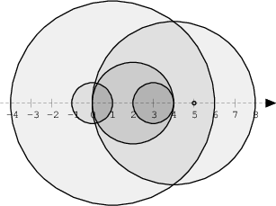
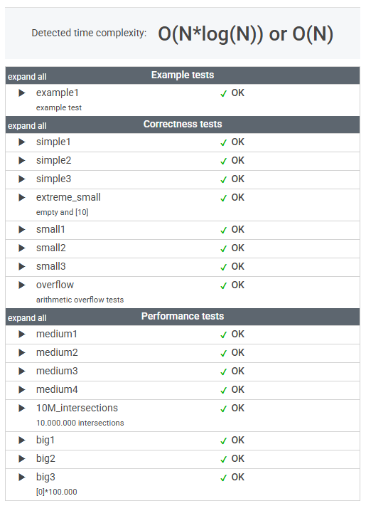

# 문제

We draw N discs on a plane. The discs are numbered from 0 to N − 1. An array A of N non-negative integers, specifying the radiuses of the discs, is given. The J-th disc is drawn with its center at (J, 0) and radius A[J].

We say that the J-th disc and K-th disc intersect if J ≠ K and the J-th and K-th discs have at least one common point (assuming that the discs contain their borders).

The figure below shows discs drawn for N = 6 and A as follows:

    A[0] = 1
    A[1] = 5
    A[2] = 2
    A[3] = 1
    A[4] = 4
    A[5] = 0


There are eleven (unordered) pairs of discs that intersect, namely:

* discs 1 and 4 intersect, and both intersect with all the other discs;
* disc 2 also intersects with discs 0 and 3.

Write a function:

    class Solution { public int solution(int[] A); }

that, given an array A describing N discs as explained above, returns the number of (unordered) pairs of intersecting discs. The function should return −1 if the number of intersecting pairs exceeds 10,000,000.

Given array A shown above, the function should return 11, as explained above.

Write an efficient algorithm for the following assumptions:

* N is an integer within the range [0..100,000];
* each element of array A is an integer within the range [0..2,147,483,647].

# 풀이

```java
    public int solution(int[] A) {
        int N = A.length;
        long[] start = new long[N];
        long[] end = new long[N];

        // 1. 시작점과 끝점 기록
        for (int i = 0; i < N; i++) {
            start[i] = (long) i - A[i];  // 왼쪽 끝점
            end[i] = (long) i + A[i];    // 오른쪽 끝점
        }

        // 2. 정렬
        Arrays.sort(start);
        Arrays.sort(end);

        // 3. 스위핑(Sweep Line) - 열린 원 개수를 세면서 교차 계산
        int intersections = 0;
        int openCircles = 0;
        int endIndex = 0;

        for (int i = 0; i < N; i++) {
            // 새 원의 시작점이 현재 열린 원들과 몇 개 겹치는지 확인
            while (endIndex < N && end[endIndex] < start[i]) {
                openCircles--;
                endIndex++;
            }

            intersections += openCircles; // 현재 열린 원들과 겹치는 개수 추가
            if (intersections > 10_000_000) return -1;

            openCircles++; // 현재 원 추가
        }

        return intersections;
    }
```


# 정리

### 초기 접근 방식

* 왼쪽 끝: (J - A[J])
* 오른쪽 끝: (J + A[J])

원 J와 원 K가 겹치려면, 다음 조건을 만족해야 한다.

    (J - A[J]) ≤ (K + A[K]) and (K - A[K]) ≤ (J + A[J])

즉, 한 원의 왼쪽 끝이 다른 원의 오른쪽 끝보다 작거나 같다면 겹친다.

__브루트포스__
```java
    public int solution(int[] A) {
        int result = 0;
        int N = A.length;

        for (int i = 0; i < N; i++) {
            for (int j = i + 1; j < N; j++) {
                if ((i - A[i]) <= (j + A[j]) && (j - A[j]) <= (i + A[i])) {
                    result++;
                }
            }
        }

        return result > 10000000 ? -1 : result;
    }
```

* 시간 복잡도: O(N²) (최악의 경우 100,000 * 100,000 = 10,000,000,000 -> 너무 느림)

최적화가 필요하다.

---

### 최종 풀이

시작점 (start[i])을 하나씩 증가 시키면서, 현재 열린 원들과 얼마나 겹치는지 체크한다.

(endIndex 로 닫힌 원을 관리한다.)

---

### 느낀 점

브루트포스 방식은 비교적 직관적으로 떠올릴 수 있었지만, 최적화된 접근 방식은 쉽게 생각나지 않았다.

특히 __"열린 원"__ 과 __"닫힌 원"__ 을 이용한 풀이 방식은 처음 접하는 개념이라 직관적으로 이해하는 데 어려움이 있었다.

단순한 좌표 비교가 아니라, 원들이 생성되고 사라지는 흐름을 따라가야 했기 때문이다.

이 문제를 통해 단순한 좌표 기반의 사고방식에서 벗어나, 이벤트 기반으로 접근하는 사고의 필요성을 절감했다.

앞으로 비슷한 유형의 문제를 접할 때, __"현재 열린 개수"__ 를 고려하는 전략을 더 깊이 고민해봐야겠다.


