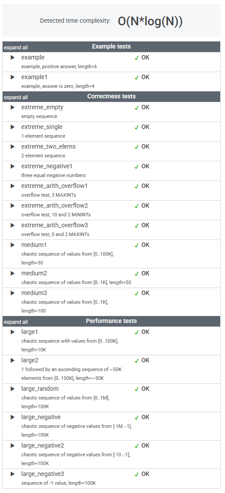

# 문제

An array A consisting of N integers is given. A triplet (P, Q, R) is triangular if 0 ≤ P < Q < R < N and:

* A[P] + A[Q] > A[R],
* A[Q] + A[R] > A[P],
* A[R] + A[P] > A[Q].

For example, consider array A such that:

    A[0] = 10    A[1] = 2    A[2] = 5
    A[3] = 1     A[4] = 8    A[5] = 20

Triplet (0, 2, 4) is triangular.

Write a function:

    class Solution { public int solution(int[] A); }

that, given an array A consisting of N integers, returns 1 if there exists a triangular triplet for this array and returns 0 otherwise.

For example, given array A such that:

    A[0] = 10    A[1] = 2    A[2] = 5
    A[3] = 1     A[4] = 8    A[5] = 20

the function should return 1, as explained above. Given array A such that:

    A[0] = 10    A[1] = 50    A[2] = 5
    A[3] = 1
the function should return 0.

Write an efficient algorithm for the following assumptions:

* N is an integer within the range [0..100,000];
* each element of array A is an integer within the range [−2,147,483,648..2,147,483,647].

# 풀이

```java
    public int solution(int[] A) {

        if (A.length <3) return 0;

        Arrays.sort(A);

        boolean exists = IntStream.range(0, A.length - 2)
                .anyMatch(i -> (long) A[i] + A[i + 1] > A[i + 2]);

        return exists ? 1 : 0;
    }
```

# 정리

### 초기 접근 방식

삼각형의 조건인 "가장 긴 변의 길이보다 나머지 두 변의 길이 합이 크다"를 만족하는지를 확인하는 로직을 작성했다.

---

### 최종 풀이

상동

---

### 느낀 점

풀이 접근은 적절했으나, Stream으로 구현할 때 필요한 메소드와 활용 방식을 더 숙지해, 직관적으로 떠올릴 수 있도록 연습이 필요하다.


