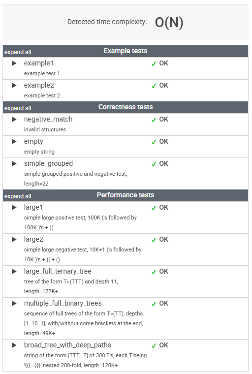

# 문제

A string S consisting of N characters is considered to be properly nested if any of the following conditions is true:

* S is empty;
* S has the form "(U)" or "[U]" or "{U}" where U is a properly nested string;
* S has the form "VW" where V and W are properly nested strings.

For example, the string "{[()()]}" is properly nested but "([)()]" is not.

Write a function:

    class Solution { public int solution(String S); }

that, given a string S consisting of N characters, returns 1 if S is properly nested and 0 otherwise.

For example, given S = "{[()()]}", the function should return 1 and given S = "([)()]", the function should return 0, as explained above.

Write an efficient algorithm for the following assumptions:

* N is an integer within the range [0..200,000];
* string S is made only of the following characters: '(', '{', '[', ']', '}' and/or ')'.

# 풀이

```java
    public int solution(String S) {

        Stack<Character> stack = new Stack<>();

        for (int i = 0; i < S.length(); i++) {
            char c = S.charAt(i);

            // 열린 괄호는 스택에 넣는다
            switch (c) {
                case '(':
                case '{':
                case '[':
                    stack.push(c);
                    break;

                // 닫힌 괄호가 나오면 스택에서 꺼내 짝을 맞춘다
                case ')':
                    if (stack.isEmpty() || stack.pop() != '(') {
                        return 0;
                    }
                    break;
                case '}':
                    if (stack.isEmpty() || stack.pop() != '{') {
                        return 0;
                    }
                    break;

                case ']':
                    if (stack.isEmpty() || stack.pop() != '[') {
                        return 0;
                    }
                    break;
            }
        }

        // 스택이 비어 있으면 올바르게 중첩된 괄호, 아니면 잘못된 괄호가 있음
        return stack.isEmpty() ? 1 : 0;
    }
```


# 정리

### 초기 접근 방식

처음에는 스택 자료구조를 활용하는 방법을 전혀 떠올리지 못하고, 단순히 반복문과 인덱스를 이용하여 괄호를 하나씩 비교하려고 했다. 

하지만 이러한 접근 방식은 중첩 구조를 효과적으로 처리하지 못하고, 예외 케이스를 관리하기가 어렵다는 한계가 있었다.

---

### 최종 풀이

열린 괄호는 스택에 쌓고,

닫힌 괄호가 나오면 스택에서 꺼내서 짝을 맞춘다.

---

### 느낀 점

상황에 따라 최적화된 자료구조를 사용하는 것이 필요하다.

