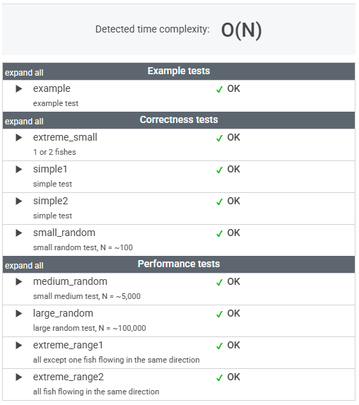

# 문제

You are given two non-empty arrays A and B consisting of N integers. Arrays A and B represent N voracious fish in a river, ordered downstream along the flow of the river.

The fish are numbered from 0 to N − 1. If P and Q are two fish and P < Q, then fish P is initially upstream of fish Q. Initially, each fish has a unique position.

Fish number P is represented by A[P] and B[P]. Array A contains the sizes of the fish. All its elements are unique. Array B contains the directions of the fish. It contains only 0s and/or 1s, where:

* 0 represents a fish flowing upstream,
* 1 represents a fish flowing downstream.

If two fish move in opposite directions and there are no other (living) fish between them, they will eventually meet each other. Then only one fish can stay alive − the larger fish eats the smaller one. More precisely, we say that two fish P and Q meet each other when P < Q, B[P] = 1 and B[Q] = 0, and there are no living fish between them. After they meet:

* If A[P] > A[Q] then P eats Q, and P will still be flowing downstream,
* If A[Q] > A[P] then Q eats P, and Q will still be flowing upstream.

We assume that all the fish are flowing at the same speed. That is, fish moving in the same direction never meet. The goal is to calculate the number of fish that will stay alive.

For example, consider arrays A and B such that:

    A[0] = 4    B[0] = 0
    A[1] = 3    B[1] = 1
    A[2] = 2    B[2] = 0
    A[3] = 1    B[3] = 0
    A[4] = 5    B[4] = 0

Initially all the fish are alive and all except fish number 1 are moving upstream. Fish number 1 meets fish number 2 and eats it, then it meets fish number 3 and eats it too. Finally, it meets fish number 4 and is eaten by it. The remaining two fish, number 0 and 4, never meet and therefore stay alive.

Write a function:

    class Solution { public int solution(int[] A, int[] B); }

that, given two non-empty arrays A and B consisting of N integers, returns the number of fish that will stay alive.

For example, given the arrays shown above, the function should return 2, as explained above.

Write an efficient algorithm for the following assumptions:

* N is an integer within the range [1..100,000];
* each element of array A is an integer within the range [0..1,000,000,000];
* each element of array B is an integer that can have one of the following values: 0, 1;
* the elements of A are all distinct.

# 풀이

```java
    public int solution(int[] A, int[] B) {

        Stack<Integer> down = new Stack<>();
        int alive = 0; // 살아남은 물고기 개수

        for (int i = 0; i < A.length; i++) {

            if (B[i] == 1) {
                // downstream 물고기는 스택에 추가
                down.push(A[i]);
            } else {
                // upstream 물고기와 downstream 물고기 비교
                while (!down.isEmpty()) {
                    // upstream 물고기가 잡아먹힘
                    if (down.peek() > A[i]) {
                        break;
                    } else {
                        // upstream 물고기가 더 크면 downstream 물고기를 제거
                        down.pop();
                    }
                }
            }

            // 싸울 상대가 없으면 살아남음
            if (down.isEmpty()) {
                alive++;
            }
        }

        // 남아있는 downstream 물고기들도 살아남음
        return alive + down.size();
    }
```


# 정리

### 초기 접근 방식

B[i] = 1 (downstream)인 물고기들은 스택에 쌓고, 

B[i] = 0 (upstream)인 물고기들이 이를 만나면 싸우는 방식으로 진행

---

### 최종 풀이

상동

---

### 느낀 점

이번 문제를 통해 스택(Stack) 자료구조의 활용을 다시금 체감할 수 있었다.

다만, 아직 스택을 활용한 문제 풀이에 익숙하지 않아서
처음에는 접근 방식이 쉽게 떠오르지 않았다.

보통 단순한 반복문이나 정렬을 먼저 떠올리는 습관이 있는데,
이번 문제처럼 순차적인 충돌과 소멸 과정을 처리해야 하는 경우에는
스택이 훨씬 직관적이고 효율적인 해결책이 될 수 있음을 깨달았다.

앞으로도 스택을 활용하는 문제들을 더 접해보면서
자연스럽게 이 자료구조를 떠올릴 수 있도록 연습해야겠다.


