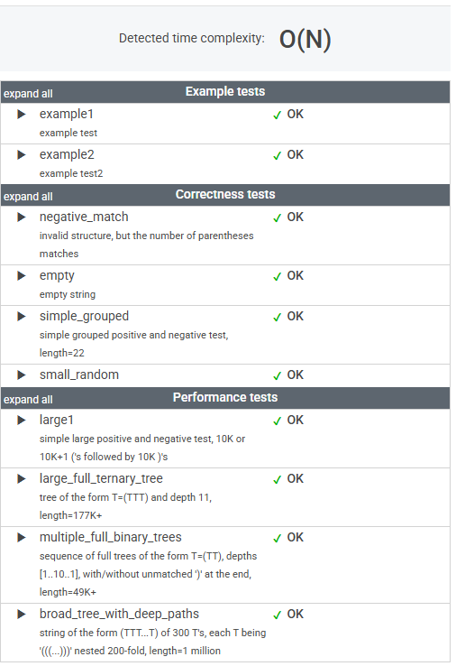

# 문제

A string S consisting of N characters is called properly nested if:

* S is empty;
* S has the form "(U)" where U is a properly nested string;
* S has the form "VW" where V and W are properly nested strings.

For example, string "(()(())())" is properly nested but string "())" isn't.

Write a function:

    class Solution { public int solution(String S); }

that, given a string S consisting of N characters, returns 1 if string S is properly nested and 0 otherwise.

For example, given S = "(()(())())", the function should return 1 and given S = "())", the function should return 0, as explained above.

Write an efficient algorithm for the following assumptions:

* N is an integer within the range [0..1,000,000];
* string S is made only of the characters '(' and/or ')'.

# 풀이

```java
    public int solution(String S) {
        Stack<Character> stack = new Stack<>();

        for (char c : S.toCharArray()) {
            if ('(' == c) {
                stack.push(c);
            } else if (')' == c) {
                if (stack.isEmpty()) {
                    return 0;
                }
                stack.pop();
            }
        }

        return stack.isEmpty() ? 1 : 0;
    }
```


# 정리

### 초기 접근 방식

처음에는 '('와 ')'를 각각 따로 스택에 넣고, 사이즈를 비교하는 방식으로 접근했다.

하지만 문제의 핵심은 단순 개수 비교가 아니라, 올바른 순서로 괄호가 닫혀야 한다는 것이었다.

즉, "())(" 같은 경우도 개수만 보면 균형이 맞지만, 올바르게 닫히지 않기 때문에 틀린 풀이였다.

---

### 최종 풀이

스택을 활용하여 '('를 만나면 스택에 push하고, 
')'를 만나면 스택이 비어있지 않은 경우에만 pop하는 방식으로 해결했다.

마지막에 스택이 비어 있다면(모든 괄호가 짝을 맞춰 닫혔다면) 올바른 문자열(1),
비어있지 않다면 잘못된 문자열(0) 을 반환하도록 구현.

---

### 느낀 점

스택 자료구조에 아직 익숙하지 않다는 것을 다시금 깨달았다.

이 문제를 풀면서 스택이 __순서가 중요한 상황에서 강력한 도구__ 라는 점을 배웠다.


