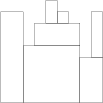
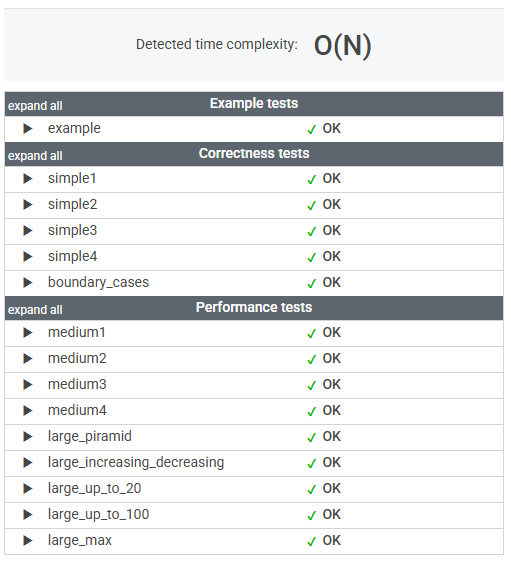

# 문제

You are going to build a stone wall. The wall should be straight and N meters long, and its thickness should be constant; however, it should have different heights in different places. The height of the wall is specified by an array H of N positive integers. H[I] is the height of the wall from I to I+1 meters to the right of its left end. In particular, H[0] is the height of the wall's left end and H[N−1] is the height of the wall's right end.

The wall should be built of cuboid stone blocks (that is, all sides of such blocks are rectangular). Your task is to compute the minimum number of blocks needed to build the wall.

Write a function:

    class Solution { public int solution(int[] H); }

that, given an array H of N positive integers specifying the height of the wall, returns the minimum number of blocks needed to build it.

For example, given array H containing N = 9 integers:

    H[0] = 8    H[1] = 8    H[2] = 5
    H[3] = 7    H[4] = 9    H[5] = 8
    H[6] = 7    H[7] = 4    H[8] = 8

the function should return 7. The figure shows one possible arrangement of seven blocks.



Write an efficient algorithm for the following assumptions:

* N is an integer within the range [1..100,000];
* each element of array H is an integer within the range [1..1,000,000,000].


# 풀이

```java
    public int solution(int[] H) {
        Stack<Integer> stack = new Stack<>();
        int blocks = 0;

        for (int height : H) {
            while (!stack.isEmpty() && stack.peek() > height) {
                stack.pop();
            }

            if (stack.isEmpty() || stack.peek() < height) {
                stack.push(height);
                blocks++;
            }
        }

        return blocks;
    }
```


# 정리

### 초기 접근 방식

각 높이에 대해 스택을 활용하여 현재 직사각형 블록이 유효한지 확인하는 방식으로 접근했다.

즉, 새로운 높이가 등장할 때마다 불필요한 블록을 제거하며, 최소한의 블록으로 벽을 구성하는 방법을 탐색했다.

---

### 최종 풀이

스택을 사용하여 이전 높이보다 낮아지는 순간 불필요한 블록을 제거하고,
새로운 높이가 필요할 경우 새로운 블록을 추가하는 방식으로 해결했다.

---

### 느낀 점

스택 자료구조는 직관적이지만, 문제 해결 과정에서 적절한 __push/pop__ 시점을 파악하는 것이 쉽지 않았다.

이 기회를 통해 스택 문제를 다시 복습하며, 다양한 유형을 직접 구현해 볼 필요성을 느꼈다.

