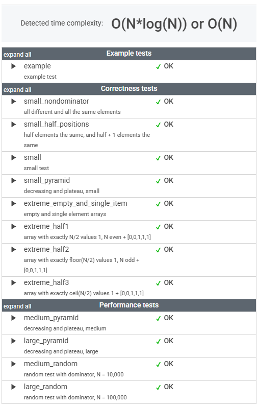

# 문제

An array A consisting of N integers is given. The dominator of array A is the value that occurs in more than half of the elements of A.

For example, consider array A such that

    A[0] = 3    A[1] = 4    A[2] =  3
    A[3] = 2    A[4] = 3    A[5] = -1
    A[6] = 3    A[7] = 3

The dominator of A is 3 because it occurs in 5 out of 8 elements of A (namely in those with indices 0, 2, 4, 6 and 7) and 5 is more than a half of 8.

Write a function

    class Solution { public int solution(int[] A); }

that, given an array A consisting of N integers, returns index of any element of array A in which the dominator of A occurs. The function should return −1 if array A does not have a dominator.

For example, given array A such that

    A[0] = 3    A[1] = 4    A[2] =  3
    A[3] = 2    A[4] = 3    A[5] = -1
    A[6] = 3    A[7] = 3

the function may return 0, 2, 4, 6 or 7, as explained above.

Write an efficient algorithm for the following assumptions:

* N is an integer within the range [0..100,000];
* each element of array A is an integer within the range [−2,147,483,648..2,147,483,647].


# 풀이

```java
    public int solution(int[] A) {
        int N = A.length;
        if (N == 0) return -1;
        
        Map<Integer, Long> frequencyMap = Arrays.stream(A)
                .boxed()
                .collect(Collectors.groupingBy(Function.identity(), Collectors.counting()));
        
        Optional<Map.Entry<Integer, Long>> dominatorEntry = frequencyMap.entrySet().stream()
                .max(Map.Entry.comparingByValue());
        
        if (dominatorEntry.get().getValue() <= N/2) return -1;
        
        int dominator = dominatorEntry.get().getKey();
        
        return IntStream.range(0, N)
                .filter(i -> A[i] == dominator)
                .findFirst()
                .orElse(-1);
    }
```


# 정리

### 초기 접근 방식

각 숫자의 등장 횟수를 맵으로 저장한다.

예를 들어, [3, 4, 3, 2, 3, -1, 3, 3] → {3=5, 4=1, 2=1, -1=1}

___max(Map.Entry.comparingByValue())___ 를 사용하여 가장 많이 등장한 숫자를 찾는다.

단, 그 숫자의 빈도가 N/2보다 작으면 지배자가 없으므로 -1 반환.

___IntStream.range()___ 로 배열을 다시 순회하며 지배자의 첫 번째 등장 인덱스를 찾는다.

---

### 최종 풀이

상동

---

### 느낀 점

Moore's Voting Algorithm은 분명 흥미로운 접근 방식이지만, 내가 푼 방법과 상당히 유사하다는 생각이 든다.

내가 푼 방식은 조금 더 직관적이고 단순해 보인다.

(Stream API 사용법에 더욱 익숙해져야겠다.)

