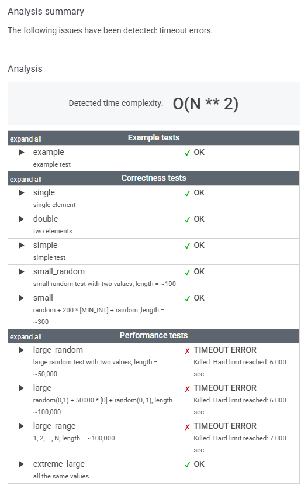

# 문제

A non-empty array A consisting of N integers is given.

The leader of this array is the value that occurs in more than half of the elements of A.

An _equi leader_ is an index S such that 0 ≤ S < N − 1 and two sequences A[0], A[1], ..., A[S] and A[S + 1], A[S + 2], ..., A[N − 1] have leaders of the same value.

For example, given array A such that:

    A[0] = 4
    A[1] = 3
    A[2] = 4
    A[3] = 4
    A[4] = 4
    A[5] = 2

we can find two equi leaders:

* 0, because sequences: (4) and (3, 4, 4, 4, 2) have the same leader, whose value is 4.
* 2, because sequences: (4, 3, 4) and (4, 4, 2) have the same leader, whose value is 4.

The goal is to count the number of equi leaders.

Write a function:

    class Solution { public int solution(int[] A); }

that, given a non-empty array A consisting of N integers, returns the number of equi leaders.

For example, given:

    A[0] = 4
    A[1] = 3
    A[2] = 4
    A[3] = 4
    A[4] = 4
    A[5] = 2

the function should return 2, as explained above.

Write an efficient algorithm for the following assumptions:

* N is an integer within the range [1..100,000];
* each element of array A is an integer within the range [−1,000,000,000..1,000,000,000].


# 정리

### 초기 풀이

```java
    public int solution(int[] A) {
        int N = A.length;
        if (N == 1) return 0;

        // 1. 리더 후보 찾기
        int candidate = Arrays.stream(A)
                .reduce((a, b) ->
                        (a == b) ? a : (Arrays.stream(A).filter(x -> x == a).count() > Arrays.stream(A).filter(x -> x == b).count() ? a : b)
                ).orElse(-1);

        // 2. candidate가 실제 리더인지 확인
        Map<Integer, Long> frequencyMap = Arrays.stream(A)
                .boxed()
                .collect(Collectors.groupingBy(Function.identity(), Collectors.counting()));

        long leaderCount = frequencyMap.getOrDefault(candidate, 0L);
        if (leaderCount <= N / 2) return 0;

        int leader = candidate;

        // 3. equi Leader 개수 찾기 (Stream)
        int[] leftCnt = {0};
        long[] rightCnt = {leaderCount};

        return (int) IntStream.range(0, N)
                .filter(i -> {
                    if (A[i] == leader) {
                        leftCnt[0]++;
                        rightCnt[0]--;
                    }
                    int leftSize = i + 1;
                    int rightSize = N - leftSize;
                    return leftCnt[0] > leftSize / 2 && rightCnt[0] > rightSize / 2;
                }).count();
    }
```



스트림에 익숙해지기 위해 스트림을 사용해 문제를 풀어보려 했으나, 스트림 내부 연산의 오버헤드로 인해 TIMEOUT_ERROR가 발생했다. 

최적의 성능을 위해서는 for-loop 버전을 사용하는 것이 가장 좋다.

---

### 최종 풀이

for-loop 버전

```java
    public int solution(int[] A) {
        int N = A.length;
        if (N == 1) return 0;

        // 1. 리더 찾기 (Boyer-Moore Majority Vote Algorithm)
        int candidate = A[0], count = 0;
        for (int num : A) {
            if (count == 0) {
                candidate = num;
                count = 1;
            } else if (num == candidate) {
                count++;
            } else {
                count--;
            }
        }

        // 2. candidate가 실제 리더인지 확인
        int leader = -1, leaderCount = 0;
        for (int num : A) {
            if (num == candidate) leaderCount++;
        }
        if (leaderCount > N / 2) leader = candidate;
        else return 0;  // 리더가 없으면 equi leader도 없음.

        // 3. equi leader 개수 찾기
        int leftCount = 0, equiLeaders = 0;
        for (int i = 0; i < N; i++) {
            if (A[i] == leader) leftCount++;

            int leftSize = i + 1;
            int rightCount = leaderCount - leftCount;
            int rightSize = N - leftSize;

            if (leftCount > leftSize / 2 && rightCount > rightSize / 2) {
                equiLeaders++;
            }
        }

        return equiLeaders;
    }
```
---

### 느낀 점

단순히 모던한 문법(스트림)을 쓰는 것보다, 문제의 특성을 이해하고 적절한 알고리즘을 선택하는 것이 더 중요하다.

스트림이 항상 최적의 선택은 아니며, 경우에 따라서는 전통적인 반복문이 더 나은 해결책이 될 수 있다.


