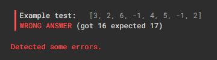

# 문제

A non-empty array A consisting of N integers is given.

A triplet (X, Y, Z), such that 0 ≤ X < Y < Z < N, is called a double slice.

The sum of double slice (X, Y, Z) is the total of A[X + 1] + A[X + 2] + ... + A[Y − 1] + A[Y + 1] + A[Y + 2] + ... + A[Z − 1].

For example, array A such that:

    A[0] = 3
    A[1] = 2
    A[2] = 6
    A[3] = -1
    A[4] = 4
    A[5] = 5
    A[6] = -1
    A[7] = 2

contains the following example double slices:

* double slice (0, 3, 6), sum is 2 + 6 + 4 + 5 = 17,
* double slice (0, 3, 7), sum is 2 + 6 + 4 + 5 − 1 = 16,
* double slice (3, 4, 5), sum is 0.

The goal is to find the maximal sum of any double slice.

Write a function:

    class Solution { public int solution(int[] A); }

that, given a non-empty array A consisting of N integers, returns the maximal sum of any double slice.

For example, given:

    A[0] = 3
    A[1] = 2
    A[2] = 6
    A[3] = -1
    A[4] = 4
    A[5] = 5
    A[6] = -1
    A[7] = 2

the function should return 17, because no double slice of array A has a sum of greater than 17.

Write an efficient algorithm for the following assumptions:

* N is an integer within the range [3..100,000];
* each element of array A is an integer within the range [−10,000..10,000].

# 정리

### 초기 풀이

```java
    public int solution1(int[] A) {
        int N = A.length;

        int[] leftSum = new int[N];
        int[] rightSum = new int[N];

        for (int i = 1; i < N - 1; i++) {
            leftSum[i] = leftSum[i - 1] + A[i];
        }

        for (int i = N - 2; i > 0; i--) {
            rightSum[i] = rightSum[i + 1] + A[i];
        }

        int maxSum = 0;
        for (int Y = 1; Y < N - 1; Y++) {
            maxSum = Math.max(maxSum, leftSum[Y - 1] + rightSum[Y + 1]);
        }
        
        return maxSum;
    }
```

leftSum과 rightSum 배열을 만들어 A[X+1]부터 A[Y-1], A[Y+1]부터 A[Z-1]까지의 합을 구하는 것 까지는 떠올랐다.

하지만, 합을 구하는 과정에서 초기 음수 값까지 그대로 누적했다. 

(TEST CASE 도 패스하지 못했다...)




예를 들어, rightSum 을 구할 때 A[6] = -1 일 경우, 누적합에 넣을 필요 없이 그냥 0 으로 치환해야 한다. 

---

### 최종 풀이

```java
    public int solution1(int[] A) {
        int N = A.length;

        int[] leftSum = new int[N];
        int[] rightSum = new int[N];

        for (int i = 1; i < N - 1; i++) {
            leftSum[i] = Math.max(0, leftSum[i - 1] + A[i]);
        }

        for (int i = N - 2; i > 0; i--) {
            rightSum[i] = Math.max(0, rightSum[i + 1] + A[i]);
        }

        int maxSum = 0;
        for (int Y = 1; Y < N - 1; Y++) {
            maxSum = Math.max(maxSum, leftSum[Y - 1] + rightSum[Y + 1]);
        }

        return maxSum;
    }

```

Math.max(0, sum)을 활용하여 음수를 배제하는 방식으로 로직을 개선했다.

---

### 느낀 점

문제를 풀면서 느낀 점은 각 문제마다 사용되는 알고리즘(이 문제는 Kadane’s Algorithm)이 있다.

그렇다면 알고리즘을 먼저 공부한 후 문제를 풀어야 할까, 아니면 문제를 풀면서 알고리즘을 익혀야 할까?

문제 난이도가 점점 높아지면서 이런 고민이 커지고 있다.
