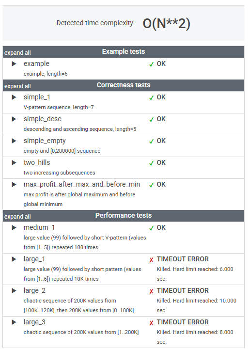

# 문제

An array A consisting of N integers is given. It contains daily prices of a stock share for a period of N consecutive days. If a single share was bought on day P and sold on day Q, where 0 ≤ P ≤ Q < N, then the profit of such transaction is equal to A[Q] − A[P], provided that A[Q] ≥ A[P]. Otherwise, the transaction brings loss of A[P] − A[Q].

For example, consider the following array A consisting of six elements such that:

    A[0] = 23171
    A[1] = 21011
    A[2] = 21123
    A[3] = 21366
    A[4] = 21013
    A[5] = 21367

If a share was bought on day 0 and sold on day 2, a loss of 2048 would occur because A[2] − A[0] = 21123 − 23171 = −2048. If a share was bought on day 4 and sold on day 5, a profit of 354 would occur because A[5] − A[4] = 21367 − 21013 = 354. Maximum possible profit was 356. It would occur if a share was bought on day 1 and sold on day 5.

Write a function,

    class Solution { public int solution(int[] A); }

that, given an array A consisting of N integers containing daily prices of a stock share for a period of N consecutive days, returns the maximum possible profit from one transaction during this period. The function should return 0 if it was impossible to gain any profit.

For example, given array A consisting of six elements such that:

    A[0] = 23171
    A[1] = 21011
    A[2] = 21123
    A[3] = 21366
    A[4] = 21013
    A[5] = 21367

the function should return 356, as explained above.

Write an efficient algorithm for the following assumptions:

* N is an integer within the range [0..400,000];
* each element of array A is an integer within the range [0..200,000].

# 정리

### 초기 풀이

```java
    public int solution1(int[] A) {
        int max = -1;

        for (int i = 0; i < A.length; i++) {
            for (int j = i; j < A.length; j++) {
                int profit = A[j] - A[i];
                if (profit > 0) {
                    max = Math.max(profit, max);
                }
            }
        }

        return max > -1 ? max : 0;
    }
```



완전 탐색(Brute Force) 방식은 직관적이지만 비효율적이다.

이중 for 루프를 사용하여 모든 가능한 (P, Q) 조합을 확인하고 있다.

더 나은 접근 방식(효율적인 알고리즘)이 필요하다.

---

### 최종 풀이

```java
    public int solution2(int[] A) {
        if (A.length == 0) return 0;

        int minPrice = A[0];
        int maxProfit = 0;

        for (int i = 1; i < A.length; i++) {
            maxProfit = Math.max(maxProfit, A[i] - minPrice);
            minPrice = Math.min(minPrice, A[i]);
        }

        return maxProfit;
    }
```

논리적으로도 간결하고 직관적

---

### 느낀 점

단순히 알고 있는 것과 실제로 사용할 수 있는 것은 다르다는 점을 다시 한번 깨달았다.

더 많은 연습과 다양한 문제를 풀어보면서 이론적인 지식이 아닌, 체화된 경험으로 만들어야겠다.