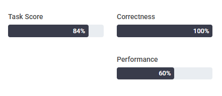
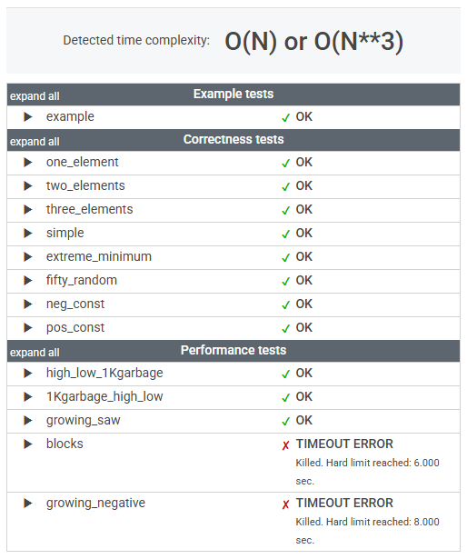

# 문제

A non-empty array A consisting of N integers is given. A pair of integers (P, Q), such that 0 ≤ P ≤ Q < N, is called a slice of array A. The sum of a slice (P, Q) is the total of A[P] + A[P+1] + ... + A[Q].

Write a function:

    class Solution { public int solution(int[] A); }

that, given an array A consisting of N integers, returns the maximum sum of any slice of A.

For example, given array A such that:

    A[0] = 3  A[1] = 2  A[2] = -6
    A[3] = 4  A[4] = 0

the function should return 5 because:

* (3, 4) is a slice of A that has sum 4,
* (2, 2) is a slice of A that has sum −6,
* (0, 1) is a slice of A that has sum 5,
* no other slice of A has sum greater than (0, 1).

Write an efficient algorithm for the following assumptions:

* N is an integer within the range [1..1,000,000];
* each element of array A is an integer within the range [−1,000,000..1,000,000];
* the result will be an integer within the range [−2,147,483,648..2,147,483,647].

# 정리

### 초기 풀이

```java
    public int solution1(int[] A) {
        int maxSum = A[0];

        for (int i = 0; i < A.length; i++) {
            int tempSum = A[i];
            maxSum = Math.max(maxSum, tempSum);
            for (int j = i + 1; j < A.length; j++) {
                tempSum += A[j];
                maxSum = Math.max(maxSum, tempSum);
            }
        }

        return maxSum;
    }
```





[_**MaxProfit**_](MaxProfit.md) 때 처럼

이중 for 루프를 사용하여 모든 가능한 (P, Q) 조합을 확인하고 있다.

더 나은 접근 방식(효율적인 알고리즘)이 필요하다.

---

### 최종 풀이

```java
    public int solution2(int[] A) {
        int maxSum = A[0];
        int currentSum = A[0];

        for (int i = 1; i < A.length; i++) {
            currentSum = Math.max(A[i], currentSum + A[i]);
            maxSum = Math.max(maxSum, currentSum);
        }

        return maxSum;
    }
```

논리적으로도 간결하고 직관적

---

### 느낀 점

[_**MaxProfit**_](MaxProfit.md)와 같은 접근 방식이라는 것은 알고 있었지만,
직접 구현하려고 하니 자연스럽게 떠오르지 않았다.

아직 완전히 내 것이 되지 않은 것 같아 더 연습이 필요하다.